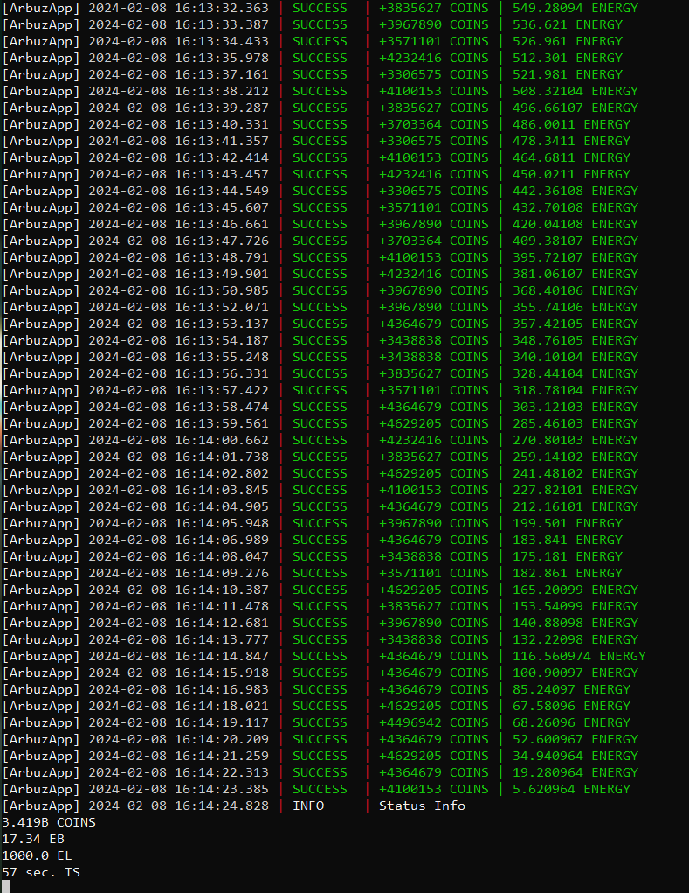

<br/>
<p align="center">
  <a href="https://github.com/llimonix/ClickARBUZ-autoclicker">
    
  </a>
  <h3 align="center">ClickArbuz Autoclicker</h3>
</p>

   

## Содержание

* [О проекте](#о-проекте)
* [Подготовка к работе](#подготовка-к-работе)
  * [Установка](#установка)
* [Дорожная карта](#дорожная-карта)
* [Создание запроса на извлечение](#создание-запроса-на-извлечение)
* [Отказ от ответственности](#отказ-от-ответственности)

## О проекте



ClickARBUZ AutoClicker - это автокликер для телеграм-бота КликниАрбуз. Скрипт настроен так, что количество кликов и время между кликами подобрано с самым наилучшим вариантом. После запуска он сам понимает сколько времени нужно ждать, чтобы вся энергия восстановилась и что можно продолжать кликать. Так же имеется отстук в телеграм, когда закончилась энергия.

## Подготовка к работе

Перед началом работы вы должны установить python версии не ниже 3.11 с официального веб-сайта www.python.org . Не забудьте установить флажок Add to PATH во время установки.

### Установка

1. Скачайте [архив](https://github.com/llimonix/ClickARBUZ-autoclicker/releases/latest) и распакуйте
2. Откройте командную строку в папке проекта или перейдите по нужному пути с помощью команды

```
cd path/ClickARBUZ-autoclicker
```
3. Установите необходимые модули

```python
pip install -r requirements.txt
```

4. Введите ваши данные и прокси (необязательно) в файле `config.env`

```
TELEGRAM_CHAT_ID=...
TELEGRAM_BOT_TOKEN=...
TELEGRAM_INIT_DATA=...
PROXY=user:pass@ip:port
PROXY_EXISTS=False
```

TELEGRAM_CHAT_ID: Ваш telegram ID можно найти в боте https://t.me/userinfobot
TELEGRAM_BOT_TOKEN: Токен бота. Бот создается в боте https://t.me/BotFather. После создания появится токен. Вы должны начать разговор со своим ботом, чтобы получать уведомления о работе кликера
TELEGRAM_INIT_DATA: Запустите telegram web- https://web.telegram.org. Нажмите ctrl + shift + i, откройте бота и нажмите "Играть". В разделе "Сеть" появится запрос на веб-сайт `
arbuz.betty.games/api/users/me`. Оттуда вам нужно скопировать свою сессию. <br>


5. Запустите основной файл проекта

```python
python arbuzapp.py
```

## Дорожная карта

Список предлагаемых функций (и известных проблем) смотрите в разделе ["Открытые проблемы"](https://github.com/llimonix/ClickARBUZ-autoclicker/issues).

## Создание запроса на извлечение

1. Сделайте форк проекта
2. Создайте свою ветку функций (`git checkout -b feature/ArbuzFeature`)
3. Зафиксируйте свои изменения (`git commit -m 'Add some ArbuzFeature")
4. Перейдите в ветку (`git push origin feature/ArbuzFeature`)
5. Откройте запрос на извлечение

## Отказ от ответственности

Использование ClickARBUZ AutoClicker осуществляется на ваш собственный риск. Я не несу ответственности за возможные блокировки или иные санкции со стороны разработчиков КликниАрбуз.

